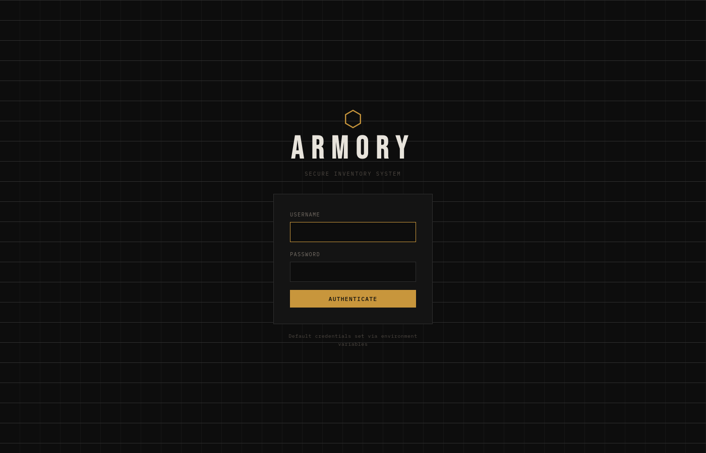
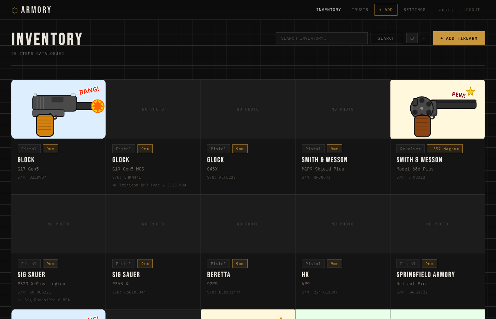
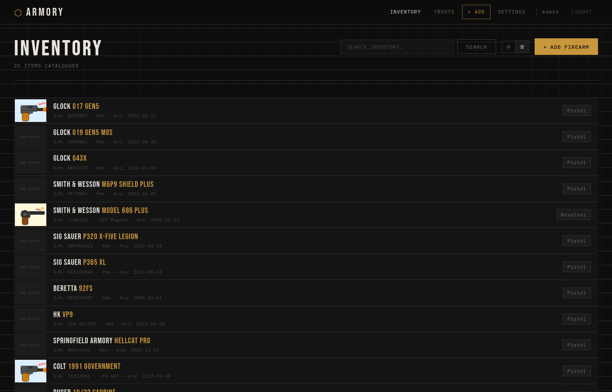
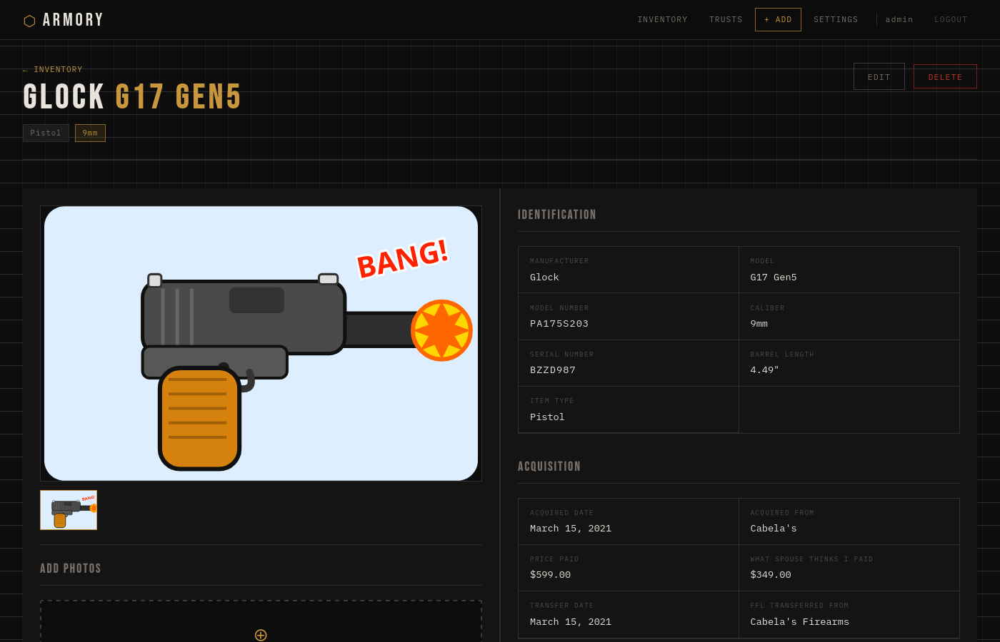
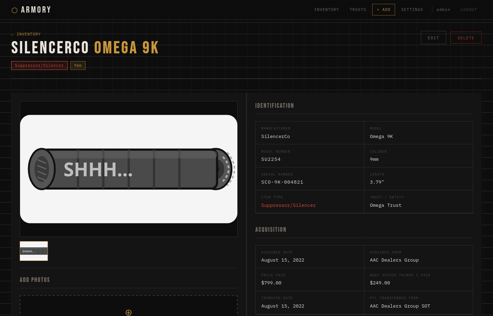
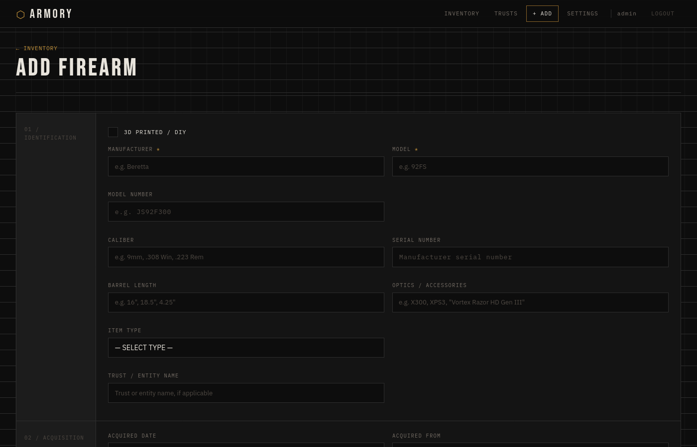
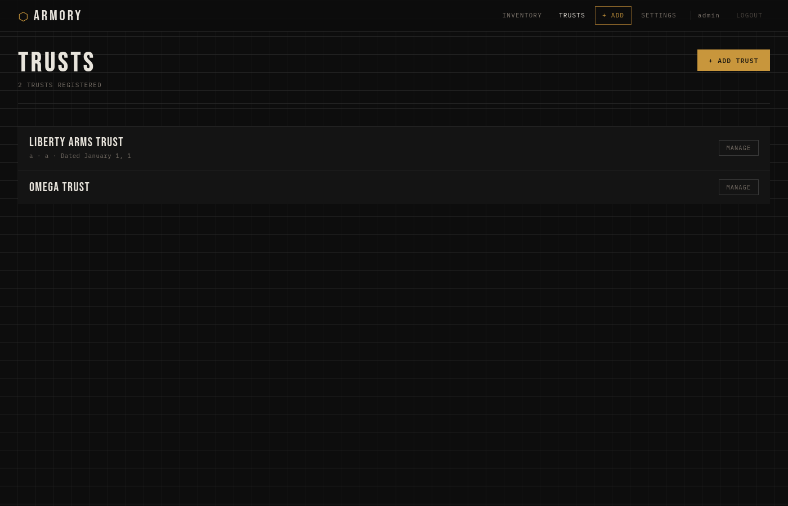
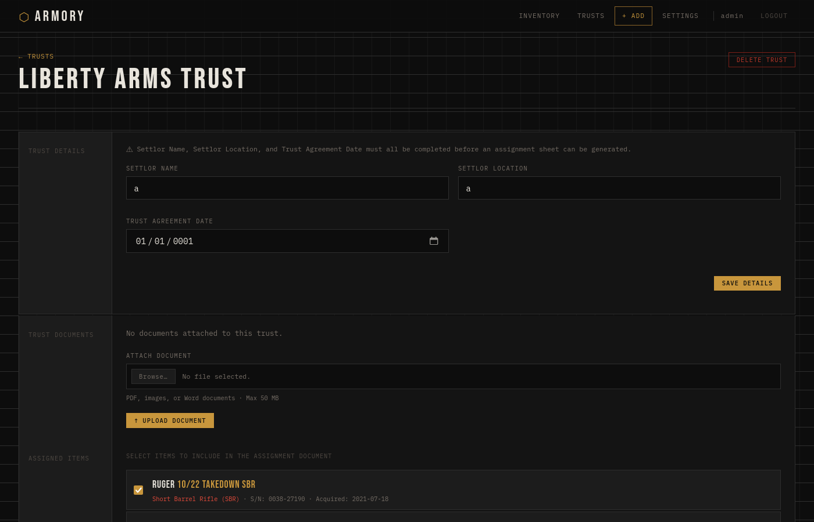
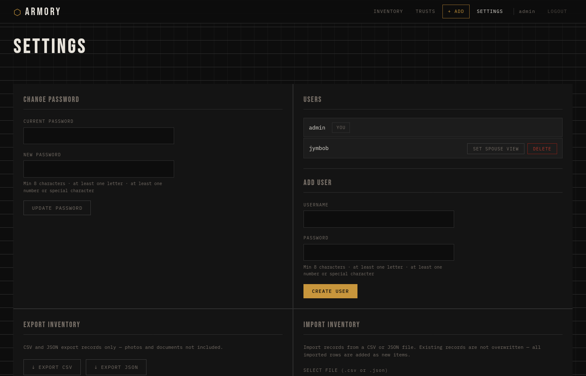

# ARMORY — Firearms Inventory System

Ever shot a machine gun on peyote? Nahh neither have I, but I've absolutely gotten drunk and fired up GunBroker at 1am, only to be genuinely surprised three weeks later when my FFL calls to let me know something came in. "A what? A... oh. Oh yeah. Yeah I'll be right there."

This app is for people like us. People who need a spreadsheet but refuse to use Excel like an adult.

---

## What Is This

A self-hosted, Dockerized web app for cataloguing your personal firearms collection. Tracks inventory, NFA paperwork, trust documents, photos, acquisition records, round counts, and — crucially — **what your wife thinks you paid for everything.**

Built for the responsible gun owner who is not always responsible about other things.

---

## Features

- **Inventory management** — manufacturer, model, caliber, serial, barrel length, optics, notes, and the quiet shame that comes with adding a 14th entry
- **Grid & list views** — because sometimes you want to *see* your collection laid out like a coffee table book your wife will never open
- **NFA tracking** — Form 1 / Form 4, FMI flag, tax stamp serial, ATF submit/approval dates, and a wait-time tracker so you can watch your will to live drain in real time
- **Trust management** — manage NFA trusts, assign items, generate printable legal assignment documents, and store the actual trust documents so you stop losing them
- **Round count** — log rounds fired per firearm; the number will be higher than you think and lower than it should be
- **Acquisition records** — what you paid, who you bought it from, when it transferred; basically a paper trail for your own future confusion
- **"What Spouse Thinks I Paid" field** — *see below*
- **3D printed firearms** — checkbox renames Manufacturer → Creator, for the true artisans among us
- **Photo gallery** — multiple photos per firearm, primary photo selection; finally a place to put those glamour shots
- **Document storage** — ATF forms, Form 5320, trust docs, and any other paperwork you've been keeping in a manila folder labeled "GUN STUFF"
- **Export / Import** — CSV and JSON export; full archive ZIP with all photos and documents
- **Search** — finds things across make, model, serial, caliber, optics, notes, and NFA type
- **Disposition tracking** — mark items as transferred/sold; the ones that got away
- **Secure multi-user access** — accounts, password hashing, session management; your collection is nobody's business but yours (and the ATF's)
- **Database purge** — requires typing `BOATING ACCIDENT` in full to confirm; this is not a joke

---

## The Spouse Mode

This is the crown jewel. The thing that makes this app worth running on a home server instead of just using a Notes document.

When you create a second user account and flag it as **Spouse View**, that account sees:

1. Only the items you've explicitly marked as visible
2. **Your "What Spouse Thinks I Paid" value** instead of what you actually paid

So if you paid $2,800 for a suppressor and $600 in tax stamp fees and four months of your life waiting for the ATF to process paperwork, your spouse's account shows whatever number doesn't start a conversation. You're welcome.

Spouse View accounts are read-only. They can browse, they can look at photos, they cannot add items, delete items, or see the Settings page where all the other items are hiding. It's not deception. It's *information architecture*.

> **To be clear:** we are not lawyers, financial advisors, or marriage counselors. This feature exists because it's funny and also genuinely useful. Use responsibly. Communicate with your spouse. Buy good guns.

---

## Quick Start

**Requirements:** Docker and Docker Compose

```bash
git clone https://github.com/yourusername/armory.git
cd armory
docker compose up -d
```

Open [http://localhost:3000](http://localhost:3000) and log in.

On first run with no credentials configured, a random admin password is generated and printed to the container logs:

```bash
docker logs armory
```

> **Change your password** in Settings after first login. Yes, actually do it.

### Custom port

```bash
ARMORY_HOST_PORT=8080 docker compose up -d
```

Or edit `docker-compose.yml` directly and set `SESSION_SECRET` to a random 32+ character string before deploying.

---

## Data Persistence

All data is stored in named Docker volumes:

| Volume | Contents |
|--------|----------|
| `armory_data` | SQLite database and sessions |
| `armory_uploads` | Firearm photos and documents |

To back up your data:

```bash
docker cp armory:/app/data ./backup/data
docker cp armory:/app/uploads ./backup/uploads
```

Or export a full archive ZIP any time from **Settings → Export Full Archive**, which packages every item with all its photos and documents into one file. Great for backups. Great for sending to your lawyer. Great for proving to your future self what you actually owned before the boating accident.

---

## Running Without Docker (Development)

```bash
npm install
node server.js
# or with auto-reload:
npx nodemon server.js
```

---

## Security Notes

- Passwords are hashed with bcrypt (cost factor 12)
- Sessions stored in SQLite, expire after 8 hours
- Per-request CSRF tokens on all state-changing forms
- Uploaded filenames replaced with UUIDs — no path traversal risk
- Photos served through authenticated routes, not public static paths
- Role changes and password changes immediately invalidate other active sessions
- Account lockout after 10 failed login attempts (15-minute cooldown)
- Structured JSON audit log to stdout for all sensitive operations
- App runs as non-root inside the container
- For production, put it behind a reverse proxy (nginx/Caddy) with HTTPS and `NODE_ENV=production`

---

## Supported File Types

| Upload Type | Accepted Formats |
|-------------|-----------------|
| Photos | JPG, PNG, GIF, WEBP — max 20 MB each |
| Documents | PDF, JPG, PNG, DOC, DOCX — max 50 MB each |

---

## Screenshots

### Login


### Inventory — Grid View


### Inventory — List View


### Firearm Detail


### NFA Item Detail


### Add Firearm


### Trust Management


### Trust Assignment


### Settings

